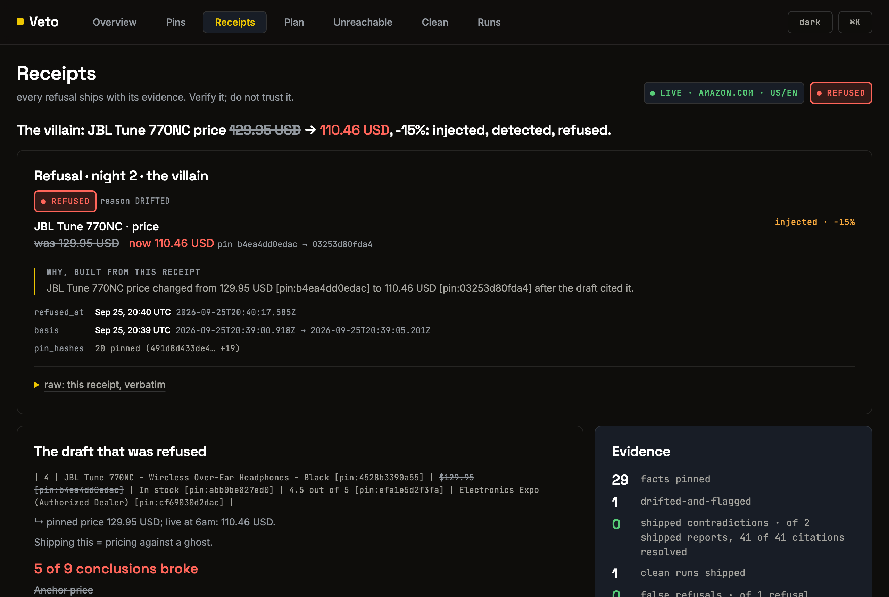

# Veto

## [See every refusal, with its receipt →](https://ishamishra0408.github.io/Veto/demo/console/)

**The ship lock for long-horizon agents.** Everyone demos what their agent remembers. We demo what ours refuses.

**An AI pricing agent pins competitor prices at 6pm, works overnight, and ships a recommendation at 6am. If a competitor dropped its price at 9pm, the recommendation matches a price that no longer exists. Veto re-checks every fact the report cites before it ships, refuses if any of them moved, and re-plans around what changed.**

**Live:** [evidence console](https://ishamishra0408.github.io/Veto/demo/console/) · [architecture](https://ishamishra0408.github.io/Veto/) · [captured runs](evidence/) — no login, nothing to install

**Nimble collects the web, live.** Veto's agent talks to Nimble's MCP server from its own code — `initialize → tools/list → nimble_extract` on five real Amazon product pages in parallel, and `nimble_search` to re-plan when a competitor page is lost or has no extractable price. Every call is traced to `mcp-trace.jsonl`, and the cite-pins rule ships as an [Agent Skill](veto/skill/SKILL.md) in Nimble's format.

**Liquid AI runs on the laptop.** Two models from [huggingface.co/LiquidAI](https://huggingface.co/LiquidAI), on-device through Ollama: `LFM2-1.2B-Extract` reads each page on its own, and a fact is pinned only if it agrees with the deterministic parser; `LFM2.5-1.2B-Instruct` writes the analysis as claims that are cite-checked before they reach a draft. The gate never calls a model.

**Tinybird keeps the history.** Every pin, check, refusal and run streams to Tinybird as it happens. Pipes serve the counts (they must equal the counts computed from the local files, which are used on their own when offline), the gate's p95 latency, and which facts move most across every live run.

**Result:** **0 shipped contradictions** · the injected −15% competitor drop caught on every run · live Amazon drift with nothing injected caught and refused · 30 adversarial red proofs pass



## The problem

Trust is a property of the moment of action, not the moment of retrieval. A long-horizon agent fetches facts, then works for hours. Grounding checks a claim while the agent writes it; nothing checks it again when the work ships. A price, a stock level or a seller can change in between, and the report still cites it as current.

Re-fetching at ship time is not enough on its own: it returns the new world, not which of the agent's *conclusions* rested on the old one. The mature-domain mirror is *Mata v. Avianca* (2023): a brief cited six cases, and none of them existed. Nobody checked the citations at the moment they were relied on.

## What it does

The agent runs a plan — plan, act, observe, self-correct — and logs every step to `plan.json`.

1. **Collect** — fetch the competitor pages through Nimble MCP; a lost page is re-planned with `nimble_search`.
2. **Pin** — every fact (title, price, stock, rating, seller) is stored with its sha256 and fetch time, but only after two extractors agree on it.
3. **Reason** — comparables → anchor → recommended price; every conclusion records the pins it rests on, and the report cites pins, never pages.
4. **Gate** — before ship, re-fetch and re-hash every cited fact. No model inside. Clean ships; drifted or unreachable refuses (fail closed).
5. **Refuse** — every refusal writes a receipt: what moved, the old and new hashes, the basis window, and a plain-English why built from the receipt itself.
6. **Self-correct** — name exactly which conclusions broke, re-fetch only the pages that drifted, recompute, disclose the old values as `[was-pin:]`, and re-gate. A fact that keeps changing while it is checked is marked unstable and not relied on.

It decides on the pinned basis, not the latest page, so a change always says which conclusions it broke.

## Result

| Run | World between fetch and ship | Verdict | Evidence |
|---|---|---|---|
| Mock, night 1 | unchanged | **CLEAN** — ships | [`mock-run`](evidence/mock-run-2026-09-25) |
| Mock, night 2 | anchor competitor −15% (injected) | **REFUSED** → re-based → **SHIPPED**, recommendation $126.09 → $107.18 | R23, R26 |
| Mock, outage | every fetch fails | **REFUSED**, `report.md` byte-identical | [`mock-run`](evidence/mock-run-2026-09-25) |
| Live, night 1 | a lost competitor page, no price injected | page replaced via `nimble_search` → **CLEAN** → ships | [`live-run-…-demo`](evidence/live-run-2026-09-25-demo) |
| Live, night 2 | anchor −15% injected on live data | **REFUSED** → 5 of 9 conclusions broke → re-based → **SHIPPED**, 0 contradictions | [`live-run-…-demo`](evidence/live-run-2026-09-25-demo) |
| Live, unforced | nothing injected; Amazon's price, stock or seller moved on its own | **REFUSED**, then re-based or refused again | [`live-run-…-final`](evidence/live-run-2026-09-25-final) |

**False refusals are counted because zero contradictions alone would flatter us.** A gate that refuses everything also ships zero contradictions. After every refusal Veto re-reads the changed pages: a fact that snaps back to its pinned value is a *flap*, and a refusal made only of flaps counts as a false refusal — the final live run recorded one. Most live refusals with nothing injected are real: Amazon's buy box, the price and seller a customer sees, rotates between fetches seconds apart.

Regenerate with `bash veto/redproofs_p1.sh && bash veto/redproofs_p2.sh && bash veto/redproofs_p3.sh` → 30 adversarial proofs, listed in [`docs/PROOFS.md`](docs/PROOFS.md). Captured runs in [`evidence/`](evidence/), each folder stating what it is and is not.

## Run locally

Needs Node 22.18+ and the `sqlite3` CLI; the proof scripts assume macOS.

```bash
git clone https://github.com/ishamishra0408/Veto && cd Veto/veto
npm install && npm run typecheck
cd .. && bash veto/redproofs_p1.sh && bash veto/redproofs_p2.sh && bash veto/redproofs_p3.sh
bash veto/demo.sh                         # mock, offline, full arc (~35 s)

# live: keys in veto/.env (gitignored) — NIMBLE_API_KEY, optional TINYBIRD_TOKEN / TINYBIRD_HOST,
# and VETO_LIQUID_URL=http://localhost:11434/v1/chat/completions for on-device Liquid
ollama pull hf.co/LiquidAI/LFM2-1.2B-Extract-GGUF:Q4_K_M
ollama pull hf.co/LiquidAI/LFM2.5-1.2B-Instruct-GGUF:Q4_K_M
bash veto/demo.sh --real --night2         # the villain night on live Amazon pages (~2 min)
```

R16 and R20 need the Tinybird keys; R19's second half runs with Liquid running. The rest need nothing.

## Repo map

```
veto/             the product (TypeScript, Node 22): adapters (mock + Nimble MCP), pins, report,
                  Liquid writer + claim checker, L1 two-extractor agreement, the gate, ship + receipts,
                  the planner and villain scenario, evidence + Tinybird stream, the Agent Skill, red proofs
evidence/         captured runs, each folder stating what it is and is not
demo/             the evidence console (published on Pages), deck, beats, diagrams, post
architecture/     the architecture model, ADRs and drift check (published on Pages)
docs/             the red-proof list, and the README's screenshot
SPEC.md           the spec; BUILD_PLAN.md, SPONSOR_FEATURES.md, FLOW.d2
```

Built during the Long Horizon Agents Hackathon 2026 by Isha Mishra and Devansh Pathak, with Claude Code.
